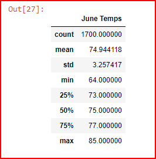
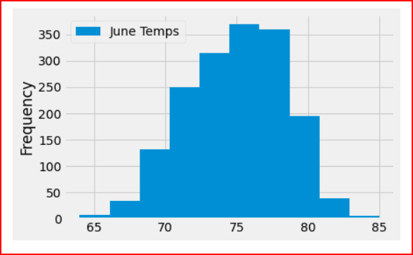
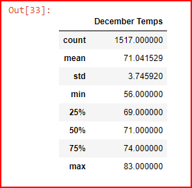
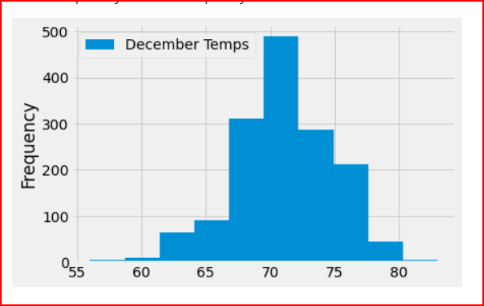

# Surfs Up

## Overview

W. Avy wants information about temperature trends before opening the surf shop. Specifically, he wants temperature data for the months of June and December in Oahu, in order to determine if the surf and ice cream shop business is sustainable year-round.

## Deliverables

Deliverable 1: Determine the Summary Statistics for June
Deliverable 2: Determine the Summary Statistics for December
Deliverable 3: A written report for the statistical analysis README.md.

## Resources

- Data Source: SurfsUp_Challenge_starter_code.ipynb named later as SurfsUp_Challenge.ipynb
- Data File: hawaii.sqlite
- Software: Matplotli 3.2.2, Python 3.9, Visual Studio Code 1.50.0, Anaconda 4.8.5, Jupyter Notebook 6.1.4, Pandas, Numpy, Sqlalchemy.

## Summary Statistics for June

## Summary Statistics for December

## Analysis

According to the results of our data analysis, the standard deviation in June was 3.25 and in December was 3.75, resulting in a difference of 0.5 between the two seasons. Furthermore, the current data contains attributes such as precipitation and others, which were the focus of our analysis. The weather data for June and December was analyzed to inform the decision-making process regarding the construction of the shop and the selection of locations that would appeal to visitors and ensure the success of the business.

